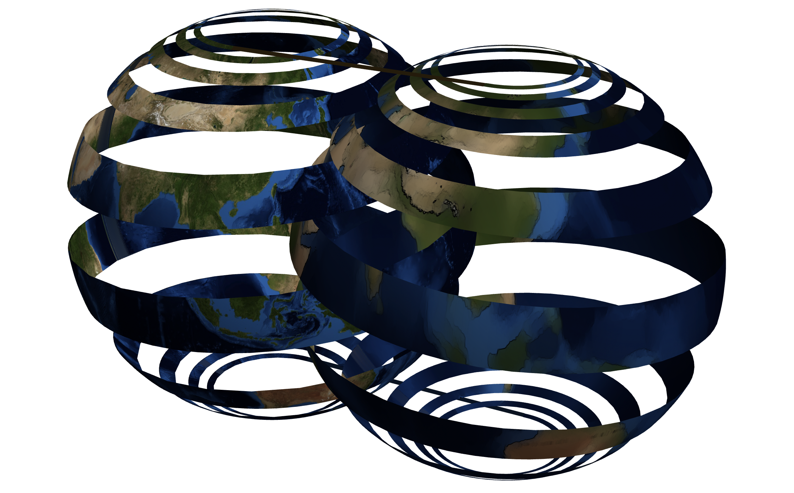
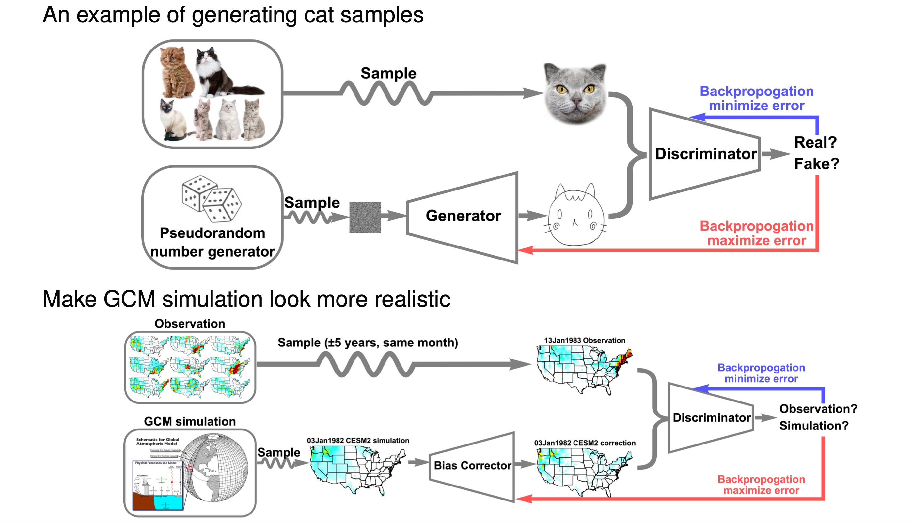
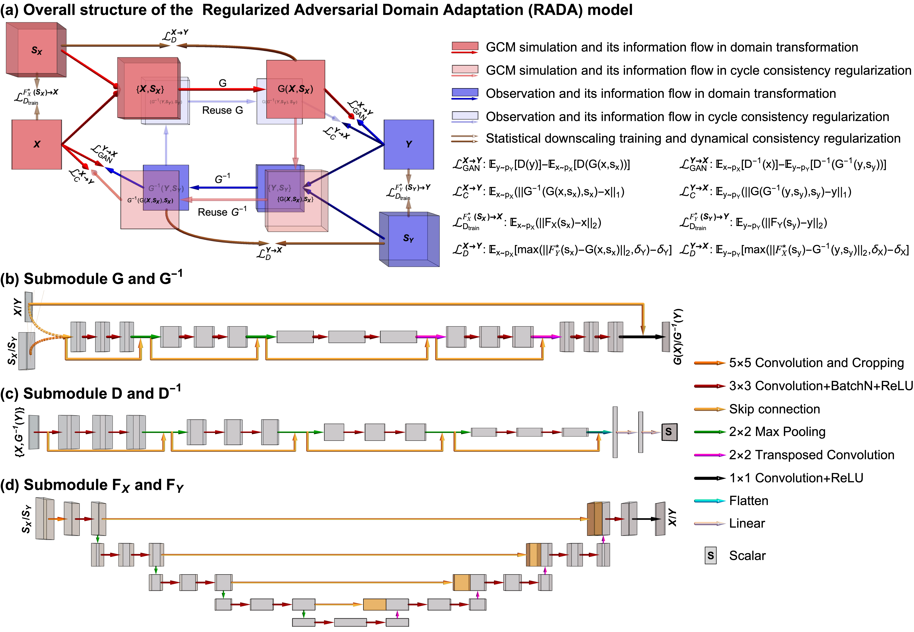

<!-- # Regularized Adversarial Domain Adaptation <br/>  — data-driven correction of climate model biases  -->
# Learning to correct climate projection biases
[**Paper in Journal of Advances in Modeling Earth Systems, 2021**](https://arxiv.org/abs/2108.02774) 


<br>
Baoxiang Pan<sup>1</sup>, Gemma Anderson<sup>1</sup>, Andre Goncalves<sup>1</sup>, Donald Lucas<sup>1</sup>, Celine Bonfils<sup>1</sup>, Jiwoo Lee<sup>1</sup>, Yang Tian<sup>1</sup>, Hsi-yen Ma<sup>1</sup>
<br> Lawrence Livermore National Lab<sup>1</sup>


## Overview
This work develops the Regularized Adversarial Domain Adaptation (RADA) methodology to correct historical climate projection biases. RADA is built on the
generative adversarial nets (GANs, Goodfellow et al. 2014), adding various constraints to guarantee phyiscal coherency. The general idea is illustrated as follows:
<br>


In the top, GAN is applied to generate cat samples. In the bottom, we make use of the adversarial learning idea to match samples from a source domain (climate simulations), to corresponding samples in a target domain (climate observations). This line of research is often named **domain adaptation** in the machine learning literature. We can not apply supervised learning, since climate is a chaotic system, preventing us from obtaining sufficient paired observation and simulation data to identify and correct climate model biases.

<!-- GANs have achieved huge success in generating high-dimensional data samples, such as images of cat (top). Besides these conventional generative modeling tasks, GANs can also be applied to close the **domain shift** problem. Here, **domain shift** refers to .
we apply adversarial learning to close the domain shift between climate simulations and historical climate observations.  
Climate models often poorly represent the unresolved processes. We apply **adversarial domain adaptation** to identify and correct these biases: 
We apply discriminative neural networks to distinguish historical climate simulation samples and observation samples. The evidences based on which the
discriminative neural networks make distinctions are applied to train the domain adaptation neural networks to bias correct climate simulations.  --> 

To guarantee physical coherency, we translate the three requirements Ehret et al. (2012) proposed for a ``perfect'' climate model bias corrector into three regularization terms to the adversarial domain adaption process, namely cycle consistency (Zhu et al. 2017), dynamical consistency (Pan et al. 2019), and dynamical dependency. The final model is illustrated as follows:

<br>


Below we provide guidance for applying RADA to correct the Community Earth System Model version 2 (CESM2, Danabasoglu et al. 2020) daily precipitation projection over the contiguous United States (CONUS).

## Getting started
### Obtain the histotical climate simulation and observation data 

The Community Earth System Model version 2 (CESM2) historical simulation data are available through https://esgf-node.llnl.gov/projects/cmip6/. 

The CPC unified gauge-based analysis of daily precipitation data are available through https://psl.noaa.gov/data/gridded/data.cpc.globalprecip.html. 

The ECMWF atmospheric reanalysis of the 20th century (ERA-20C) data are available through https://www.ecmwf.int/en/forecasts/datasets/reanalysis-datasets/era-20c.

Cut, regrid, and normalize the data:

```mathematica
math -script Data_Processing.m
```

### RADA
#### Dynamical regularization

#### RADA training
```bash
python run_metrics.py --models_list weights/eval_list --output metric_results.csv
```

#### Baseline

#### Evaluation

## Acknowledgments

This work was performed under the auspices of the U.S. Department of Energy by Lawrence Livermore National Laboratory under contract DE-AC52-07NA27344. Lawrence Livermore National Security, LLC. The views expressed here do not necessarily reflect the opinion of the United States Government, the United States Department of Energy,or Lawrence Livermore National Laboratory. This work was supported by LLNL Laboratory Directed Research and Development project 19-ER-032. This document is released with IM tracking number LLNL-JRNL-817982. 

<!-- ## Reference

If you find this useful for your research, please cite the following work.
```
@inproceedings{wang2021sketch,
  title={Sketch Your Own GAN},
  author={Wang, Sheng-Yu and Bau, David and Zhu, Jun-Yan},
  booktitle={Proceedings of the IEEE International Conference on Computer Vision},
  year={2021}
}
```

Feel free to contact us with any comments or feedback. -->
